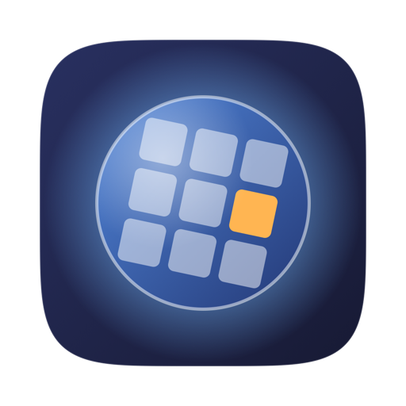

# Setscry

A native macOS app that tells you what is inside a folder of images: duplicates, near-duplicates, files that won't open, lopsided folders, and train/test leakage. Everything runs on your Mac.

Drop a folder in. Setscry reads every file once, then splits the findings into focused views instead of one long table. Nothing is uploaded, and nothing is deleted without you confirming it.


## What it finds

| View | What it means |
| --- | --- |
| **Overview** | A few numbers that each mean one thing, not a single invented score |
| **Exact duplicates** | Byte-identical files, grouped, with the space you would get back |
| **Near duplicates** | The same picture resized, re-compressed or lightly edited |
| **Won't open** | Empty, truncated and corrupt files |
| **Folder balance** | How many images are in each subfolder, with an imbalance ratio |
| **Split leakage** | One image in more than one split, which inflates reported accuracy |
| **Search** | Find images by describing them, not by filename |
| **Clusters** | Groups of images that look alike, which is how overrepresented subjects show up |
| **Label check** | Images closer to another folder's images than to their own |

Exact duplicates and corruption are facts. Everything else is a suggestion to confirm, and removal always goes to the trash. The sidebar keeps the two kinds of finding apart.

Click any image for a full-size look with its metadata. Right-click for Quick Look, Reveal in Finder, Copy path and Find similar images. Drag an image out to Finder or another app to take it elsewhere, holding Command as you drop to move rather than copy. `⌘E` exports the findings as CSV or as a self-contained HTML page.

In a duplicate group Setscry picks a file to keep, preferring the one whose name does not read as a copy, and you can change that with a click or by dragging the image you want onto the group.

## Installing it

Download the latest zip from [Releases](../../releases), unzip it, and drag **Setscry.app** to Applications. Requires macOS 15 or later on Apple silicon.

The app is signed ad-hoc rather than notarized, so macOS quarantines the download and the first launch needs one extra step: open it, then allow it under **System Settings ▸ Privacy & Security**. Or from a terminal:

```sh
xattr -dr com.apple.quarantine /Applications/Setscry.app
```

Apple silicon only, deliberately. MLX's Metal backend does not support Intel Macs, so a universal build would ship a half where the model-backed views could never work.

## The model

Setscry reads images with **CLIP** (LAION's ViT-B/32), which ships inside the app. There is nothing to download, no account, and no network request at any point.

CLIP puts images and text in one shared space. That is what makes the last three views possible: an image and the phrase "a dog on a beach" get vectors you can compare directly, so you can search a folder by describing what you want instead of remembering a filename. The same vectors, compared to each other, give the clusters and the label check.

The weights ship in half precision, which is exactly what the app computes in, so it is the same model at half the size: 605 MB becomes 303 MB. `Scripts/make-app.sh` does the conversion through `prepare-model` when it builds the bundle, so the repository stays source-only.

## Building it

Requires macOS 15 or later and Swift 6.

```sh
swift run -c release Setscry                            # opens the drop zone
swift run -c release Setscry --folder ~/datasets/cats   # opens a folder straight away
swift test                                              # 63 tests, no network, no checked-in fixtures

./Scripts/make-app.sh 1.1                               # build Setscry.app and a zip
```

`⌘O` opens a folder, the File menu keeps a recent list, `⌘1` to `⌘9` jump between sections, and `⌘?` explains what everything does.

Use `-c release` for real folders. Debug builds run the model about six times slower, because MLX's C++ is compiled unoptimised along with everything else.

A source build has no bundled weights, so the first run fetches them from Hugging Face and caches them under `~/Library/Application Support/Setscry/Models`. Only the packaged app carries them.

### Metal kernels

MLX needs its kernels compiled into `mlx.metallib` and will not start without them, not even on the CPU. Since Xcode 26 the Metal compiler is no longer bundled, and `swift build` never invokes it, so a command-line build has no kernels. `Scripts/make-app.sh` handles this for the packaged app. For a source build, either option works:

```sh
# Option A: fetch Apple's prebuilt kernels (~50 MB), pinned to the exact
# MLX version mlx-swift vendors.
swift build -c release
./Scripts/fetch-mlx-metallib.sh

# Option B: install the Metal compiler itself (~700 MB) and build in Xcode,
# which then compiles the kernels for you.
xcodebuild -downloadComponent MetalToolchain
```

Without the kernels the deterministic views still work in full, and the model-backed ones say what is missing instead of crashing. `swift test` passes either way; the MLX tests skip themselves.

## How it works

```
folder -> scan (metadata, SHA-256, decode check, perceptual hash, colour signature)
       -> analysis (duplicate grouping, leakage, health)
       -> CLIP embeddings -> search, clusters, label checks
       -> SwiftUI views
```

Four targets, with the dependency arrow pointing one way:

- **`SetscryCore`** is all the deterministic analysis. No AppKit, no SwiftUI, no ML. Value types only, so every finding is testable without a screen or a model.
- **`SetscryML`** is the model seam, and dependency-free on purpose. `EmbeddingProvider` is the whole interface; clustering, label checks and vector search are written against `Embedding`, so they never learn which model produced it. `FeaturePrintEmbedder` is a second conformance over Vision's built-in feature print, which keeps the seam honest.
- **`SetscryMLX`** is a CLIP dual encoder on MLX, conforming to `TextEmbeddingProvider`. The only target that knows MLX exists. A different checkpoint is a `CLIPModelSource` away; a different architecture is one new conformance.
- **`Setscry`** is the SwiftUI app. `AppModel` owns the deterministic half and `SemanticModel` the model-backed half, so the app runs fully with the second one switched off.

### The embedding cache

Reading a large folder with a model is the slowest thing Setscry does, and doing it again on every reopen was the main thing standing between it and real use. The vectors are written to `~/Library/Application Support/Setscry/Embeddings/<model>.embeddings` as a 128-byte header followed by fixed-size records, so appending is a seek and a write, and reading is arithmetic rather than parsing.

The key is the SHA-256 the scan already computes, which buys more than surviving a reopen. Renaming a file, copying it, or moving it to another folder all land on the same cached vector, because the key describes the bytes rather than the path.

Records are appended after every batch of sixteen, so quitting part-way through a large folder keeps the work done so far. A record left half-written by that quit is detected on load and the file is truncated back to alignment. Without that, every later append would be misaligned and the cache would return quiet garbage. **File ▸ Clear cached image readings** says how much space it holds and throws it away.

### Duplicate detection

Two signals, because either alone is wrong:

- A **64-bit dHash** compares brightness structure, so it survives resizing and re-encoding. It is also colourblind, so on its own it treats every recolouring of one design as the same image.
- A **4×4 colour signature** catches exactly that case.

Two images count as the same picture only when they agree on both. Measured against real files, genuine resized copies score a colour distance of 0 while recoloured variants of one design score 20 to 89, so the threshold of 12 sits in open space.

Byte-identical files satisfy both conditions automatically, so exact copies always cluster.

### Leakage

Leakage runs over every usable record rather than one representative per duplicate family. Collapsing duplicates first would hide the most important case: an identical file copied into both `train` and `test`. Findings are grouped per image rather than per pair, so a file copied three times across two splits is reported once, as one leaked image.

Labels and splits come from folder names (`root/train/tabby/001.jpg`). Anything that does not fit that shape is reported as unlabeled rather than guessed at.

### The CLIP port

`SetscryMLX` implements CLIP's text and vision towers directly against MLX rather than pulling in a model runtime. Both are small, and writing them out keeps the parts that are easy to get quietly wrong visible:

- Modules use the checkpoint's own parameter names, `pre_layrnorm` typo included, so weights load by name with no remapping table to drift. Loading verifies with `.all`, which fails loudly on a missing, unused or mis-shaped parameter instead of producing plausible nonsense.
- The activation is read from `config.json`. OpenAI's checkpoints use `quick_gelu`, LAION's use `gelu`, and the wrong one degrades every result without any error.
- Inference runs in float16. That needs a causal mask whose masked value is finite in the type. The usual `-1e9` is already infinity in half precision, which makes the *unmasked* entries `0 × infinity`, and every text embedding comes back `NaN` while images keep working.
- Images are decoded straight to the size the model needs, with the limit derived from the aspect ratio so wide images are not upscaled back.

## Performance notes

Scanning hashes and decodes files concurrently but bounded, so a folder of 100,000 images does not open 100,000 file handles. Corruption checking and perceptual hashing share one thumbnail decode rather than decoding twice.

Embedding runs at roughly **150 images/sec** in a release build on an M-series Mac (900×700 JPEGs, batches of 16), so about eleven minutes for 100,000 images, once. Decoding happens concurrently across cores while the model runs, which matters most on large photographs: on 36-megapixel HEICs, decoding costs more than the forward pass.

Similarity comparison is pairwise, which is fine into the tens of thousands of images. Past that, a metric-tree index over the hashes is the next step. Vector search is exact brute force for the same reason.

### On size

- The **download is about 320 MB**, unpacking to a 432 MB app: 303 MB of CLIP weights, 125 MB of Metal kernels, and a 16 MB binary.
- The **cached vectors** are about 2 KB per image, in one file you can clear from the File menu.
- A **source checkout builds to roughly 3 GB** under `.build`, because MLX's C++ is compiled twice and SourceKit keeps a third index tree. None of it ships. `swift package clean` reclaims it.

