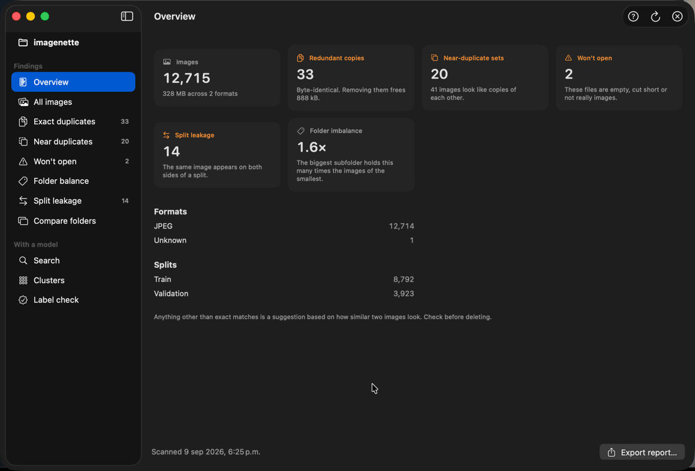
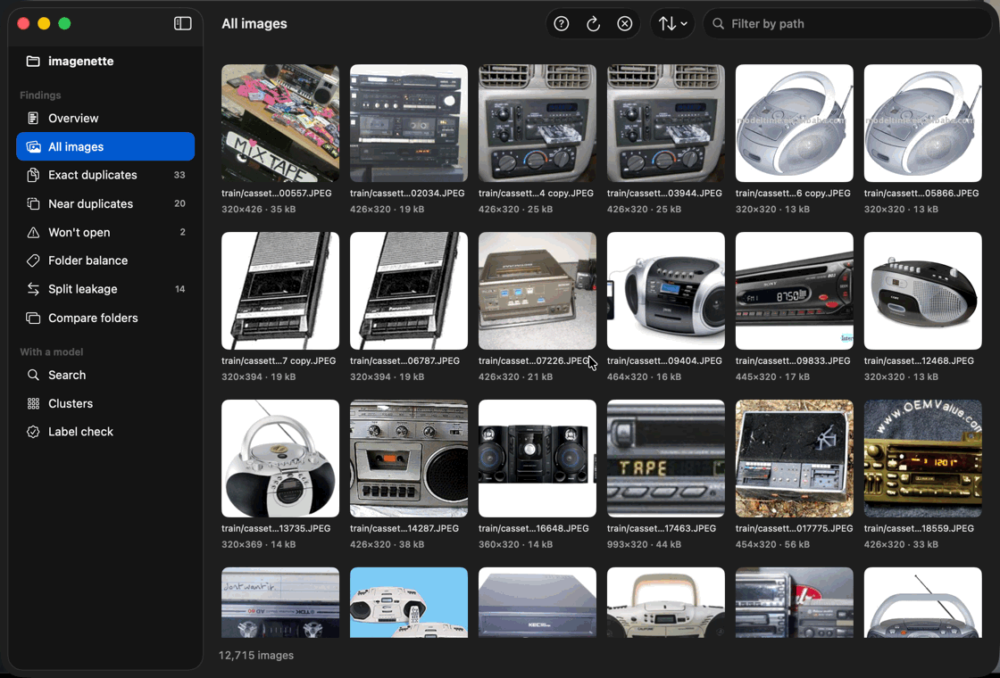
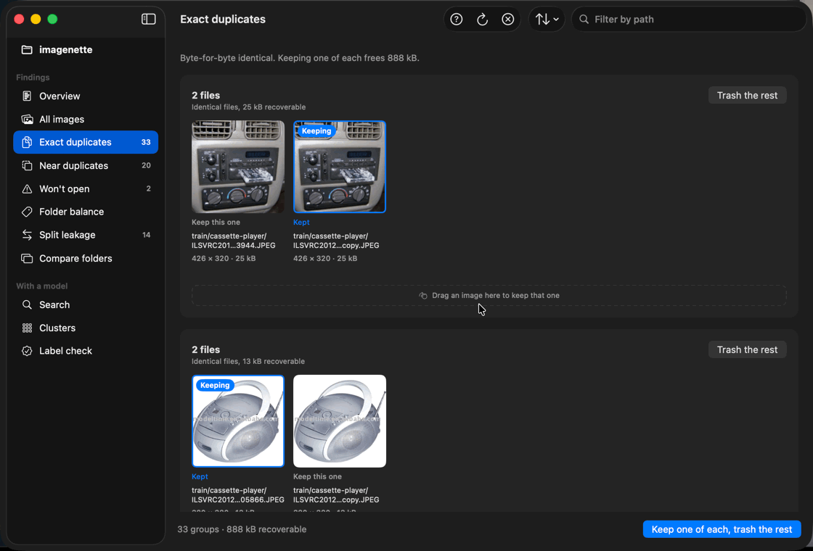
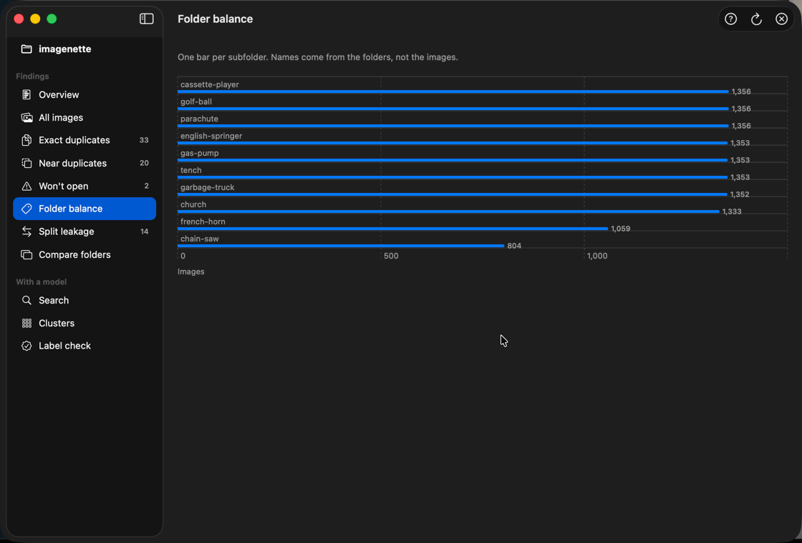
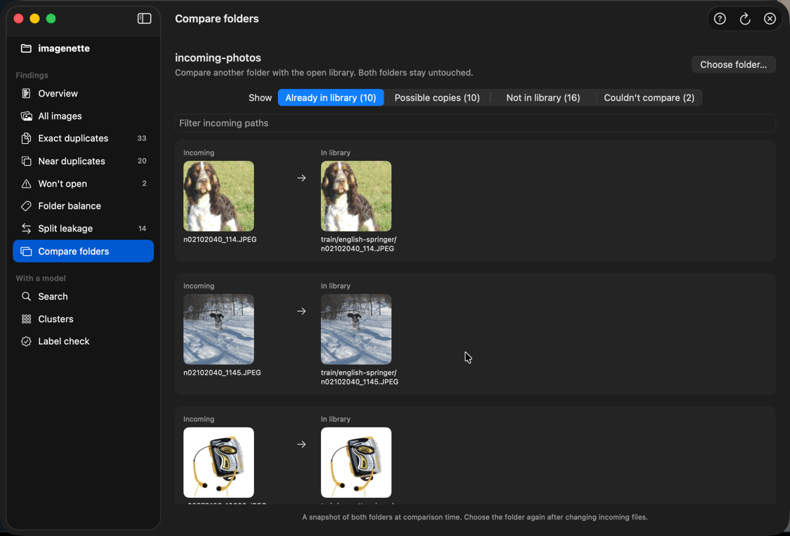
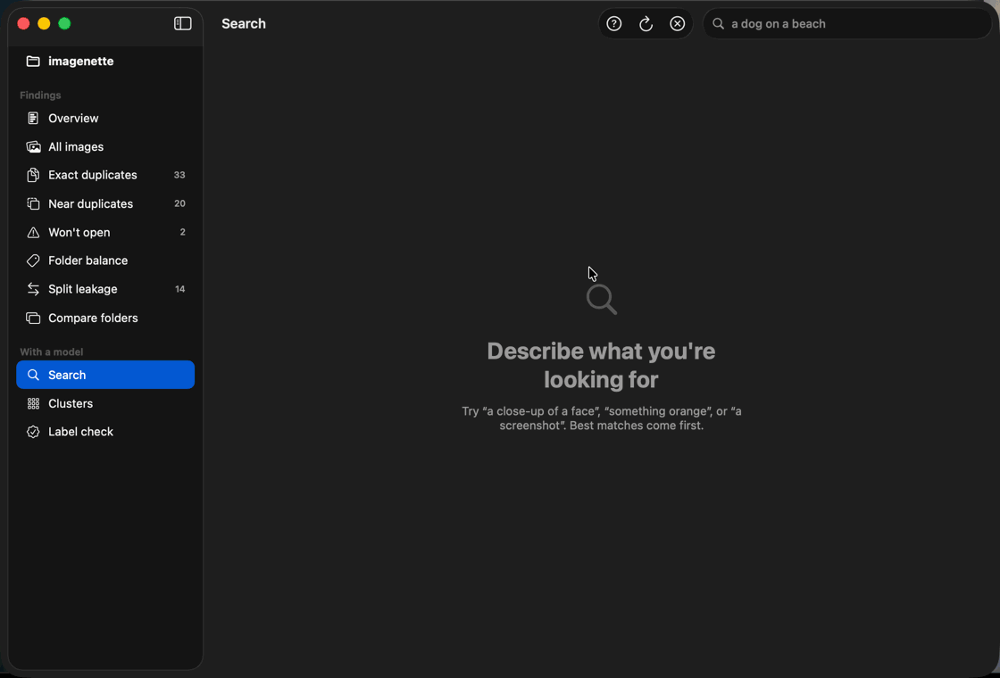

# Setscry


A native macOS app for understanding and cleaning a folder of images. Find duplicates,
broken files, uneven folders and train/test leakage; search by description; or check
whether incoming photos are already in your library. Everything runs on your Mac.

[](https://github.com/rsendz/setscry/actions/workflows/ci.yml)

## What it finds

Drop a folder in. Setscry reads its images and separates the findings into focused views.
Exact duplicates and corruption are facts. Visual similarity and model-backed findings
are suggestions to review.



| View | What it shows |
| --- | --- |
| **Overview** | Image counts, space used and the findings that need attention |
| **All images** | Every image, including those with nothing wrong |
| **Exact duplicates** | Byte-identical files and the space their extra copies take |
| **Near duplicates** | Images resized, re-compressed or lightly edited |
| **Won't open** | Empty, corrupt and truncated files |
| **Folder balance** | Images per subfolder and the imbalance between them |
| **Split leakage** | The same image appearing in more than one dataset split |

### Browse and filter

Sort findings by path, size, dimensions or date. Press `⌘F` to filter paths. Click an image
for its preview and metadata; right-click for Quick Look, Reveal in Finder or Copy path.
Drag images to another app to copy them, or hold Command while dropping to move them.



### Choose the copy to keep

Setscry suggests a keeper in each duplicate group. Choose another with **Keep this one**,
or drag it onto the group's keeper area. Removal asks for confirmation and moves files
to the Trash. `⌘Z` restores them; `⇧⌘Z` redoes the move.



### Keep up with incoming files

The open folder is watched, including new subfolders. Findings refresh after file activity
settles, while the current view stays open. Pause this with **File ▸ Watch folder for
changes**, or refresh manually with `⌘R`.



A refresh rescans the folder and reuses cached embeddings when you next read the images.
Surviving keeper choices stay selected. External changes clear undo history so an old
snapshot cannot replace newer findings.

### Compare two folders

Open your library, then choose **File ▸ Compare with folder…** (`⇧⌘O`). Each incoming image
is checked directly against the library using the same content hashes and visual
fingerprints as duplicate detection.



**Already in library** means byte-identical. **Possible copies** means visual structure and
colour agree. **Not in library** means neither check found a match. Unreadable files are
listed separately.

Comparison is read-only and needs no model. The folders must be separate, with neither
inside the other. Results are a snapshot: compare again after changing incoming files.
Changes detected in the open library invalidate the comparison.

### Search by describing an image

Search for what a picture shows, such as “mountains and a lake.” **Clusters** groups similar
images, and **Label check** flags images closer to another folder's contents than their own.
Choose **Read the images** once to prepare these views.



These views use **CLIP**, LAION's ViT-B/32 image and text model. Its weights ship inside the
app: no account, upload or model download is needed. Cached vectors survive reopening,
renaming and copying because they are keyed by file content.

*Demos recorded in Setscry 1.5 on a working copy of [Imagenette](https://github.com/fastai/imagenette):
12,715 labelled photos in a train and validation split, with deliberate copies, resized copies,
an empty file and a truncated one.*

## Installing

Download the disk image from [Releases](../../releases/latest), open it, and drag
**Setscry.app** onto Applications. Requires macOS 15 or later.

The app is signed ad-hoc. On first launch, allow it under **System Settings ▸ Privacy &
Security**, or remove the download quarantine from a terminal:

```sh
xattr -dr com.apple.quarantine /Applications/Setscry.app
```

The app is universal. Scanning, duplicate detection and folder comparison work on both
Apple silicon and Intel. Search, Clusters and Label check require Apple silicon because
MLX's Metal backend is unavailable on Intel.

### From source

Requires macOS 15 or later and a Swift 6.3 toolchain for the pinned MLX dependency.

```sh
swift run -c release Setscry
swift run -c release Setscry --folder ~/datasets/cats
swift test

./Scripts/bundle.sh                 # universal app and disk image in dist/
```

Use a release build for real folders. A source build has no bundled model, so its first
model-backed operation downloads weights to `~/Library/Application Support/Setscry/Models`.
The packaged app already includes them.

MLX also needs compiled Metal kernels. The bundle script handles this. For a source build:

```sh
swift build -c release
./Scripts/fetch-mlx-metallib.sh
```

Alternatively, install Apple's Metal compiler with `xcodebuild -downloadComponent MetalToolchain`
and build in Xcode. Without kernels, deterministic features remain available and the
model-backed views explain what is missing. MLX tests skip themselves when unavailable.

### Controls

| Action | Shortcut |
| --- | --- |
| Open a folder | `⌘O` |
| Compare with another folder | `⇧⌘O` |
| Jump between the first nine views | `⌘1`–`⌘9` |
| Focus the current search/filter field | `⌘F` |
| Rescan | `⌘R` |
| Export findings as CSV or HTML | `⌘E` |
| Undo / redo a trash operation | `⌘Z` / `⇧⌘Z` |
| Help | `⌘?` |

## How it works

```
folder → scan → deterministic analysis → focused SwiftUI views
            └→ cached CLIP embeddings → search, clusters, label checks
incoming folder → scan → compare with the open library
filesystem events → debounced refresh
```

- **SetscryCore** holds metadata, hashes, duplicate detection, leakage, folder comparison
  and report export. Value types keep it testable without a window or model.
- **SetscryML** defines the embedding interfaces, cache, vector search, clustering and
  label checks. It has no MLX dependency; Vision provides a second embedding backend.
- **SetscryMLX** implements CLIP's image and text towers against MLX. It is the only target
  that knows the model runtime.
- **Setscry** contains the SwiftUI views and app state. Deterministic features work even
  when the model is unavailable.

**Two signals for near duplicates.** A 64-bit dHash compares brightness structure; a 4×4
colour signature prevents recoloured artwork from being treated as the same image.
Comparison checks matches directly, so a chain of similar images cannot imply a match
between unrelated endpoints.

**Checking incomplete files.** ImageIO can decode truncated images without reporting an
error. Setscry also checks the format's required structure for JPEG, PNG, GIF, WebP and
HEIC. Labels and splits come from folder names such as `train/tabby/001.jpg`.

**Persistent embeddings.** Vectors live in `~/Library/Application Support/Setscry/Embeddings`
as fixed-size records indexed by SHA-256. Each completed batch is appended immediately;
a partial final record is discarded on the next load. **File ▸ Clear cached image readings**
shows the space used and clears the cache.

## Performance

Scanning bounds concurrent file reads. Corruption checking and perceptual hashing share
one thumbnail decode. Folder watching batches filesystem activity into a refresh instead
of starting a scan for every event.

Measurements from a release build on an M-series Mac, using synthetic records:

| Operation | 10,000 images | 100,000 images |
| --- | --- | --- |
| Near-duplicate comparison, worst case with no matches | 0.06 s | 5.1 s |
| Exact vector search over a contiguous buffer | 1.5 ms | 12 ms |

Folder comparison uses a hash lookup for exact matches and pairwise checks for visual
matches. Its visual work grows with the product of the two folder sizes.

The 1.5 disk image is **345 MB** (329 MiB), installing an app of roughly **452 MiB**.
Half-precision CLIP weights and Metal kernels account for most of it. Cached vectors use
about **2 KB per unique image**. Build products stay under `.build`; `swift package clean`
reclaims that space.

## License

[MIT](LICENSE). Bundled dependencies retain their own terms:
[mlx-swift](https://github.com/ml-explore/mlx-swift) is MIT licensed; the
[CLIP model card](https://huggingface.co/laion/CLIP-ViT-B-32-laion2B-s34B-b79K) carries the
weights' licence. Transitive dependencies `swift-argument-parser` and `swift-numerics`
are Apache 2.0 licensed.
